# Main Branch System Map

This map is a visual index, not the source of truth. If the diagram disagrees
with a contract, decision, CLI test, or shipped behavior, the linked source
wins.

Use it to find the right surface quickly: where facts live, where judgment
happens, where private data stops, and which systems are views or rails.

Source anchors:

- [Ethos](../ethos.md) - product principles and state model.
- [System architecture](../system-architecture.md) - repo shape, primitives,
  schemas, and routing.
- [Operator loops](../operator-loops.md) - Sense, Decide, Ship, Reflect.
- [Dependency choices](../dependency-choices.md) - provider, sidecar, and
  dependency boundaries.
- [Compatibility](../compatibility.md) - runtime support status.
- [OSS operating checklist](../oss-operating-checklist.md) - public/private,
  release, runtime, and PR review checks.

## Monster Map

```mermaid
flowchart TB
  operator["Operator<br/>business owner or team"]

  subgraph runtime["Agent runtime layer"]
    claude["Claude Code<br/>supported runtime"]
    codex["Codex CLI<br/>experimental CLI-first adapter"]
    future["Cursor / OpenClaw / Hermes / local runtimes<br/>roadmap until adapter + smoke evidence"]
    skills["Bundled mb-* skills<br/>judgment, routing, writing, review, explanation"]
  end

  subgraph engine["Main Branch engine repo"]
    cli["mb CLI<br/>deterministic control plane"]
    tests["tests + scripts/check.sh<br/>static and CLI gates"]
    templates["templates + packaged data<br/>business repo scaffolding"]
    docs["docs + decisions + changelog<br/>public product truth"]
    roadmap["roadmap + issue lanes<br/>direction, anti-scope, active work"]
    release["release machinery<br/>CHANGELOG, GitHub Release, PyPI, Linear release"]
    supply["supply-chain gates<br/>OIDC, pypi environment, dependency review"]
  end

  subgraph brain["Business repo - durable business brain"]
    core["core/<br/>offer, audience, voice, strategy, operations, finance policy"]
    growthcraft["offer sharpening + AI SEO/recognition<br/>content strategy and conversion knowledge"]
    research["research/<br/>point-in-time findings"]
    decisions["decisions/<br/>accepted choices and rationale"]
    bets["bets/<br/>time-boxed hypotheses and verdicts"]
    pushes["pushes/<br/>launches, promos, outreach, internal adoption"]
    playbooks["playbooks + run records<br/>repeatable operating recipes"]
    logs["log/ + documents/<br/>meeting summaries, fulfillment notes, session memory"]
    data["data/&lt;provider&gt;/source.md<br/>safe data-source records"]
    mbstate[".mb/<br/>explicit operational state, caches, indexes, private folders"]
    wiring["CLAUDE.md / AGENTS.md / .claude/<br/>runtime handoff and skill wiring"]
  end

  subgraph hidden["Hidden technical memory"]
    git["git history<br/>saved checkpoints and evolution story"]
    ghissues["GitHub issues<br/>public durable tasks, blockers, follow-ups"]
    prs["pull requests<br/>proposals and review conversations"]
    checks["GitHub Actions / checks<br/>CI and release gates"]
    linear["Linear<br/>visual planning and release layer"]
  end

  subgraph rails["Provider and deploy rails"]
    github["GitHub<br/>repos, issues, PRs, releases, checks"]
    cloudflare["Cloudflare<br/>sites, DNS, Pages deploy rail"]
    google["Google / Workspace / Ads / GTM<br/>planned and readiness-checked provider paths"]
    meta["Meta Ads<br/>planned official provider path"]
    apify["Apify and research sidecars<br/>optional read-only enrichment"]
    postiz["Postiz-style scheduling<br/>candidate rail until full smoke"]
    sync["scheduled sync<br/>cron, launchd, Task Scheduler, or GitHub Actions"]
    sidecars["optional sidecars<br/>narrow JSON contracts, degraded when missing"]
  end

  subgraph private["Private and sensitive boundaries"]
    books["private bookkeeping vault<br/>real hledger journal, statements, imports"]
    hledger["hledger<br/>chosen bookkeeping engine for mb books"]
    secrets["secret stores<br/>OS keychain, environment, provider auth, GitHub secrets"]
    raw["raw provider/customer/legal/account data<br/>never broad repo memory by default"]
  end

  subgraph views["Viewing surfaces"]
    obsidian["Obsidian<br/>optional local graph/backlinks viewer"]
    dashboard["future dashboard<br/>view over repo, GitHub, provider facts"]
    sites["sites, wiki, blog, public pages<br/>ship surfaces from approved content"]
  end

  subgraph loops["Operator loops"]
    sense["Sense<br/>read state"]
    decide["Decide<br/>choose the wager"]
    ship["Ship<br/>produce and release"]
    reflect["Reflect<br/>extract the lesson"]
  end

  operator --> claude
  operator --> codex
  claude --> skills
  codex --> cli
  future -. planned adapters .-> cli
  skills --> cli
  skills --> brain

  cli --> brain
  cli --> templates
  cli --> tests
  cli --> git
  cli --> github
  cli --> cloudflare
  cli --> data
  cli --> mbstate
  cli --> wiring

  docs --> cli
  docs --> skills
  docs --> templates
  docs --> roadmap
  roadmap --> ghissues
  roadmap --> linear
  tests --> release
  release --> supply
  release --> github
  release --> linear

  core --> decisions
  core --> growthcraft
  growthcraft --> research
  growthcraft --> pushes
  research --> decisions
  decisions --> bets
  bets --> pushes
  pushes --> playbooks
  pushes --> logs
  data --> decisions
  data --> pushes
  logs --> reflect
  reflect --> core

  brain --> git
  git --> ghissues
  ghissues --> prs
  prs --> checks
  checks --> git
  ghissues <--> linear

  github --> ghissues
  github --> prs
  github --> checks
  github --> release
  cloudflare --> sites
  google --> data
  meta --> data
  apify --> research
  postiz --> pushes
  sync --> data
  sidecars --> data

  books --> hledger
  hledger --> cli
  books -. safe summaries only .-> core
  books -. safe summaries only .-> logs
  secrets -. handles only .-> cli
  raw -. sanitized summaries only .-> brain

  brain --> obsidian
  brain --> dashboard
  github --> dashboard
  data --> dashboard
  pushes --> sites
  decisions --> sites
  core --> sites

  cli --> sense
  skills --> decide
  skills --> ship
  skills --> reflect
  git --> reflect
  ghissues --> decide
  release --> reflect

  classDef control fill:#e8f1ff,stroke:#2f5ea8,stroke-width:1px,color:#14213d;
  classDef judgment fill:#fff6d6,stroke:#a06a00,stroke-width:1px,color:#332200;
  classDef memory fill:#e9f8ee,stroke:#2b7a3d,stroke-width:1px,color:#12331b;
  classDef external fill:#f3f1ff,stroke:#6750a4,stroke-width:1px,color:#211a44;
  classDef private fill:#ffe8e8,stroke:#b42318,stroke-width:1px,color:#3b0a06;
  classDef view fill:#eef7f8,stroke:#227c89,stroke-width:1px,color:#082f36;

  class cli,tests,templates,docs,roadmap,release,supply control;
  class skills,claude,codex,future judgment;
  class brain,core,growthcraft,research,decisions,bets,pushes,playbooks,logs,data,mbstate,wiring,git memory;
  class github,ghissues,prs,checks,linear,cloudflare,google,meta,apify,postiz,sync,sidecars external;
  class books,hledger,secrets,raw private;
  class obsidian,dashboard,sites view;
```

## Ownership Table

| Surface | Owns | Does not own | Source |
| --- | --- | --- | --- |
| `mb` CLI | Deterministic facts, repo shape, validation, migration, status, graph, provider readiness, updates, skill wiring, checkpoint planning. | Judgment-heavy writing, model conversations, broad provider products, secret storage. | [Ethos](../ethos.md), [README](../../README.md#for-contributors-and-power-users) |
| Skills | Judgment, routing, synthesis, drafting, review, explanation, session flow. | Structural invariants that `mb` can check, raw provider mutation without approval, repo-health probes in prose. | [AGENTS](../../AGENTS.md#product-shape), [Operator loops](../operator-loops.md) |
| Business repo | Durable business memory: core files, research, decisions, bets, pushes, logs, documents, safe data records, approved summaries. | Secrets, raw finance/legal/account data, rebuildable caches as source of truth. | [System architecture](../system-architecture.md), [OSS checklist](../oss-operating-checklist.md) |
| Git and GitHub | History, issues, proposals, checks, releases, public coordination. | Private operational notes or customer/member/account details. | [Checks and review model](../checks-and-review-model.md), [Issue drafting](../issue-drafting.md) |
| Linear | Visual board, mirrored planning, release grouping, private/internal notes when needed. | Public durable issue truth or GitHub closure semantics. | [AGENTS](../../AGENTS.md#branches-issues-and-releases) |
| Cloudflare | Site, DNS, and Pages deploy rail where smoke-tested. | Source history, default repo hosting, or hidden business memory. | [Dependency choices](../dependency-choices.md#concrete-applications), [Repo visibility rubric](../repo-visibility-rubric.md) |
| hledger and books vault | Authoritative bookkeeping journal and raw finance sources. | Team-visible business memory by default. | [Books](../books.md), [mb books decision](../../decisions/2026-05-11-mb-books-foundation.md) |
| Obsidian and future dashboard | Views over repo, GitHub, graph, provider, and safe summary facts. | Source of truth, enforcement layer, or hidden database of record. | [Obsidian decision](../../decisions/2026-05-09-obsidian-first-class-viewer.md), [Roadmap](../roadmap.md) |

## Current Stance

| Claim | Current stance |
| --- | --- |
| CLI owns facts. | `mb` is deterministic, scriptable, inspectable, and exit-coded. Skills should call it for repo and provider facts before advising. |
| Skills own judgment. | Skills interpret, write, route, and explain. They should not replace CLI checks with prose guesses. |
| hledger owns books. | The hledger journal is the bookkeeping source of truth for `mb books`; real books live in a private bookkeeping vault. |
| GitHub is repo, checks, and history. | GitHub issues are durable tasks, PRs are proposals, Actions/checks gate changes, Releases mark package-visible publication. |
| Cloudflare is site and deploy. | Cloudflare is the adopted site/DNS/Pages rail where evidence exists; GitHub Pages is not the default setup path. |
| Real private data stays out of broad repos. | Secrets, raw ledgers, account exports, customer/member data, legal records, and machine-specific paths stay in secret stores, private vaults, provider systems, or local ignored state. |
| Runtime support stays honest. | Claude Code is supported. Codex CLI is experimental and CLI-first. Other runtimes are roadmap until adapter and smoke evidence exist. |

## Data And Privacy Boundaries

| Data class | Right home | Public-safe pointer |
| --- | --- | --- |
| Business truth | Business repo tracked files under `core/`, `research/`, `decisions/`, `bets/`, `pushes/`, `log/`, `documents/`. | Markdown links, typed frontmatter links, `mb graph`, checkpoints. |
| Provider metrics | `data/<provider>/` records, SQLite, snapshots, and reports when the rows are safe for the repo audience. | `data/<provider>/source.md`, `linked_data_sources`, reports. |
| Scheduled sync state | `.mb/private/sync/` and scheduler logs; ignored local state or hosted-runner logs. | `source.md` freshness and sanitized run summaries. |
| Real bookkeeping | Private bookkeeping vault using hledger; separate private repo for teams when needed. | `core/finance/books.md`, sanitized finance summaries, bookkeeping policy. |
| Credentials | OS keychain, environment, provider-native auth, GitHub Actions secrets. | `mb connect` safe metadata and readiness state. |
| Raw customer, member, legal, account, or transcript data | Provider systems, private repos, private vaults, or explicit local ignored storage. | Sanitized summaries, approved excerpts, or no pointer. |

Sources: [Data-source registry](../data-source-registry.md),
[Scheduled data sync](../scheduled-data-sync.md),
[Books](../books.md), and
[Workspace and sensitive-data boundaries](../../decisions/2026-05-04-workspace-repo-sensitive-data-boundaries.md).

## Loop Map

| Loop | Main Branch surfaces | External rails and views |
| --- | --- | --- |
| Sense | `mb status`, `mb start`, `mb doctor`, `mb graph`, `mb connect status`, core files, MoneyPath readiness, data-source records, GitHub activity. | Provider APIs, scheduled sync, Obsidian, future dashboard. |
| Decide | `/mb-start`, `/mb-think`, ranked actions, MoneyPath blockers, decisions, bets, GitHub issues. | Linear board, provider readiness signals, roadmap lanes. |
| Ship | `/mb-site`, `/mb-ads`, `/mb-organic`, `mb connect`, `mb update`, `mb issue open`, `mb checkpoint`, pushes, playbooks. | Cloudflare Pages/DNS, GitHub PRs/checks, provider dashboards, scheduling rails. |
| Reflect | `/mb-end`, bet close/narrate, retros, CHANGELOG, release notes, checkpoint history. | GitHub Releases, PyPI verification, Linear releases, dashboard/history views. |

## Release And Validation Map

| Gate | Owns | Source |
| --- | --- | --- |
| Level 0 docs and decisions | Public-safe wording, links, release truth, no stale claims. | [OSS checklist](../oss-operating-checklist.md) |
| Level 1 static | `scripts/check.sh` from repo root. | [AGENTS](../../AGENTS.md#validation-ladder) |
| Level 2 CLI contract | Focused tests for commands, exit codes, JSON, TTY/non-TTY behavior. | [JSON output contract](../json-output-contract.md) |
| Level 3 package/install | Build, install, `mb --version`, skill inventory. | [AGENTS](../../AGENTS.md#validation-ladder) |
| Level 4 fixture repo | Fresh `mb onboard`, `mb doctor`, `mb status`, `mb start --json`, `mb validate`. | [Release simulations](../release-simulations.md) |
| Level 5 runtime smoke | Real runtime discovery and behavior, especially Claude Code when skill invocation changes. | [Claude Code runtime dogfood](../claude-code-runtime-dogfood.md) |
| Supply-chain gate | OIDC trusted publishing, PyPI environment approval, dependency review, workflow permissions. | [Supply-chain policy](../supply-chain-policy.md) |

## Runtime Adapter Map

| Runtime | Status | Contract |
| --- | --- | --- |
| Claude Code | Supported. | Slash skills and `mb start` handoff are the reference runtime path. |
| Codex CLI | Experimental CLI-first adapter. | Fresh business repos include `AGENTS.md`; Codex should run deterministic `mb` fact commands and ask before writes. |
| Cursor, OpenClaw, Hermes, Paperclip-adjacent orchestration, local runtimes | Roadmap. | No support claim until adapter code, docs, generated-file rules, and fresh-repo smoke evidence exist. |

Source: [Compatibility](../compatibility.md).

## What To Update When The Map Moves

Update this map when a source contract moves, not when a private plan changes.
Typical triggers:

- a new accepted decision changes repo boundaries, provider rails, runtime
  support, or private data handling;
- `mb` gains a new deterministic surface that skills or dashboards depend on;
- a provider rail graduates from planned to adopted with smoke evidence;
- release, supply-chain, package, or runtime validation gates change;
- docs rename a primitive that appears in the map.

Keep examples sanitized. Link issues only after checking the live GitHub issue
state.
